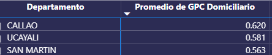
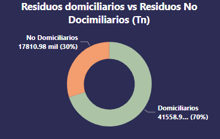

<h1 align="center">Residuos municipales generados anualmente</h1>

Este Dashboard ofrece una visualización detallada y clara de los datos sobre los residuos municipales generados a lo largo de los años. Proporciona una perspectiva intuitiva sobre la cantidad de residuos producidos anualmente en las distintas regiones y distritos.

Importante saber que...

    La generación per cápita (GPC) de residuos domiciliarios corresponde a la cantidad de residuos sólidos generados diariamente por habitante de una vivienda, a nivel distrital. La unidad de medida es en kg/hab./día.

<h2>Hallazgos</h2>
<ul>
    <li>Promedio GPC en el Perú (2014-2021): 0.47</li>
    <li>Tomando en cuenta los 2 últimos años, la región selva tiene mayor promedio de GPC: 0.53</li>
    <li>Tomando en cuenta los 2 últimos años, la Provincia Constitucional del Callao tiene mayor promedio de GPC: 0.62</li>
    </img>
    <li>Departamentos con mayores residuos generados: Lima - Piura - La Libertad, también son las que mayor población tienen.</li>
    <li>La región Selva es la que genera menos toneladas de residuos</li>
    <li>Del total de residuos generados un 70% corresponde a los residuos domiciliarios</li>
    </img>
</ul>